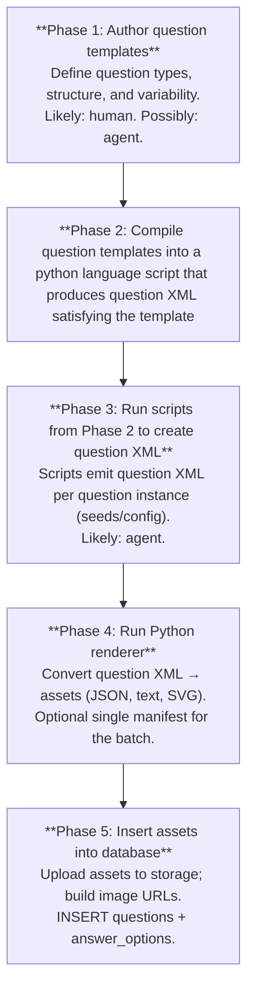

# Question generation – design

This document describes the design of the **question generation pipeline**: how questions (including picture-based and NVR) are produced, stored as assets, and inserted into the database for use by the practice app.

---

## 1. Purpose and scope

**Goal:** Generate batches of questions (text and/or picture-based) from templates, then make them available in the app by uploading assets and inserting rows into the database.

**In scope:**

- Running template scripts to produce question content (e.g. SVGs + metadata).
- Aggregating output into a single manifest for the batch.
- Uploading option (and optional question) images to storage.
- Inserting `questions` and `answer_options` rows with correct metadata and image URLs.

- The current scope of this document is to outline diagrammatic NVR questions only.

**Out of scope here:**

- Authoring or editing individual questions in the UI.
- The exact content of each template (see this document §4 and template repos).

**References:**

- **11plus-datamodel-design.md** — Schema for `questions`, `answer_options`, `subjects`, `topics`.
- **QUESTION-GENERATION-BATCH.md** — Concrete two-script flow and manifest shape (when using a batch runner).

---

## 2. Standard workflow (four phases)

The pipeline is split into four phases so that authoring, code generation, rendering, and database insert can be done separately and by different actors (human vs agent).



- **Phase 1** — Templates and specs; no scripts or DB.
- **Phase 2** — Produce Python template scripts from question templates.
- **Phase 3** — Use template scripts to create multiple question XML files.
- **Phase 4** — Consumes XML; produces JSON, text, SVG (and optionally manifest).
- **Phase 5** — Consumes manifest + asset dirs; needs storage config and DB connection.

---

## 3. Question assets purpose and overview

This section describes the key assets required and produced in the workflow described in section 2.

### Question Templates

This is a human readable brief written document that uses keywords to describe a question, which are defined throughout this document.  

The template will be loosely written in English, but using strictly defined keywords and rules for default behaviour defined in this document. 

Generating the script from a question template is a highly non-deterministic process that will be best handled by an agent.

The question templates are our core assets on the contents of our product and require human time investment to produce.  They are not expendable nor easily regenerated.

### Template Scripts

This is a primarily machine-readable, agent-generated procedural language script (likely Python) which is considered an expendable asset.

The scripts should use standard reusable library functions to perform any tasks related to NVR logic or otherwise. A template script may be run any number of times to produce a novel question that adheres to the template.

Creating the template scripts will be a highly non-deterministic process and will be handled by agents.

### Question XML

A question XML document is a logically unambiguous definition of a single (usually diagrammatic) question.

It contains all of the necessary references (e.g. subject and topic identifiers) to place the question in our product. It also contains a nested XML structure describing the diagrams required for the question itself and any answers, including overall layout and formatting for each element of a diagram.

The question XML deliberately does not have sufficient detail to unambiguously define the precise visual layout of all elements described—for example the renderer will have some leeway to choose random locations; the XML may call for items to be placed randomly within a region of a diagram.

Generating question assets from XML is therefore a slightly non-deterministic process, where two outputs from runs of the same script may produce slight visual variations, but no logical variations.

### Question Assets

SVG Diagram files and JSON - these are the final product, precise question definitions with no remaining ambiguity.

---

## 4. Keywords and verbal question templates

Question templates (Phase 1 output) must use **only** the keywords and rules defined in this section. This section gives the **NVR visual vocabulary** (**element** (3.1)—generic term for any part of the structure: shapes, motifs, layouts, arrays, stacks—then layout, shape containers, motifs, line types, line terminations, line augmentations, shading types, partitions, and concepts), then the full rules for writing verbal question templates (parameters, variators, differentiator, parameter choice rules, frequency modifiers).

---

### NVR visual vocabulary (dictionaries)

The following dictionaries define the **only** allowable motifs, line types, line terminations, and shading types for NVR-style diagram questions. All diagrammatic descriptions must reference these by **key** (e.g. `circle`, `dashed`). No ad hoc terms; extend the dictionaries only when this spec is updated. **Element** (3.1) is the generic term for any part of the structure (shapes, including motifs; and layouts—**stack**, **chaotic**, and **array** are layout types). **Layout** (3.2) defines how content is arranged: the **default layout** is a **single centred element**; other layout types are **chaotic** (e.g. multiple motifs inside a shape with irregular spacing), **stack**, and **array**. Motifs may appear in any layout type. **Shape containers** (3.3) are the first dictionary; then motifs, line types, line terminations, line augmentations, and shading types. A shape may be **partitioned** into sections with their own shading. Generated SVGs must use only these options so that `circle` or `dashed` is identical across questions.

**Element** is the generic term for any part of the diagram structure. **Shapes** (including **motifs**—small, indivisible shapes that cannot be partitioned), and **layouts** are elements. **Stack**, **chaotic**, and **array** are **layout types**—each is a type of layout, not a separate concept. A **layout** may arrange any type of element: e.g. shapes, motifs (in any layout), or **nested layouts** (e.g. "an array of two stacks"). The following subsections define layout (3.2), shape containers (3.3), and the other vocabulary used to describe elements.

**Vocabulary element** is the generic term for any single entry from these dictionaries: a **shape container**, **motif**, **line type**, **line termination**, **line augmentation**, or **shading type**. In this document, vocabulary elements are quoted in backticks when used as formal terms (e.g. `circle`, `dashed`, `arrow_single`). When writing a verbal question template, the generator chooses random vocabulary elements and sticks with those same choices for part or all of that question (see Template terminology below).

#### Element (3.1)

An **element** is any part of the diagram structure. Elements are either **shapes** (including **motifs**—small, indivisible, cannot be partitioned) or **layouts**. **Stack**, **chaotic**, and **array** are all **layout types**: each is a kind of layout. A layout arranges one or more elements; those elements may be shapes/motifs or **nested layouts** (e.g. an array of two stacks). A diagram is composed of a root element (see Layout (3.2)). For the default layout ("one element centred"), that root may be a single shape container or a layout (stack or array) that itself contains elements. When we say “one element centred” (default layout), that element may be a single shape container.

#### Layout (3.2)

**Layout** is how the diagram (or a region) arranges its content. The **layout types** are **single centred** (default), **chaotic**, **stack**, and **array**—so stack, chaotic, and array are all types of layout. Templates and question XML specify a layout type; the renderer produces the corresponding arrangement.

**Content of a layout:** A layout may arrange **any type of element**: shapes (including motifs), or **nested layouts**. For example, a question may call for "an array of two stacks"; or "a shape with motifs" (motifs may appear in any layout type—single centred, chaotic, stack, or array). **Chaotic** is one layout type that often arranges multiple motifs inside a single shape container with irregular spacing.

**Default layout: single centred element.** When the template does not specify a layout type (or when there is a single shape with no motifs), the **default layout** is a **single centred element**: one element (e.g. one shape container) centred in the answer image. Its centre coincides with the centre of the answer viewBox. No stack, no array, no multiple motifs—just one centred element.

**Layout types** (when the template specifies something other than the default):

| Layout type | Description | When to use |
|-------------|-------------|-------------|
| **Single centred** (default) | One element centred in the answer image. | Default when the template does not specify stack, array, or multiple motifs inside a shape. |
| **Chaotic** (layout of motifs) | Multiple motifs inside a shape container; motifs placed so they do not overlap (e.g. centre-to-centre at least 12.5 in a 100×100 answer). | When the template asks for a shape containing multiple motifs with irregular (non-grid) spacing. |
| **Stack** | Depth-ordered overlapping shapes (bottom drawn first, above drawn over). | When the template asks for "N shapes in a stack", "a square with a circle on top", etc. |
| **Array** | Multiple elements in a regular arrangement; default **rectangular** (grid rows × columns). Subtypes: **orbital** (1D, evenly on a circle), **triangular** (2D tapering formation). | When the template asks for "2×2 array of triangles", "six shapes in an orbital array", "triangular array of circles", etc. |

**Layout type: single centred (default).** One element (e.g. one shape container) is centred in the answer image; its centre coincides with the centre of the answer viewBox. Used when the template does not specify stack, array, or multiple motifs inside a shape.

**Layout type: chaotic (layout of motifs).** When placing **multiple motifs** inside a shape container, use **chaotic** layout so that motifs do not overlap (e.g. minimum centre-to-centre distance). Motifs are placed with irregular (non-grid) spacing within the shape. Wherever motifs are placed, the **fill** must be **solid** or **white**—not hatched (see Motif dictionary: motifs and shading).

**Layout type: stack.** A **stack** is a layout that orders elements by depth: the **bottom** element is drawn first, elements **above** are drawn over it. **In general, stack children should be shapes.** Nested layouts (stack or array) as direct children are possible but should be used only when necessary; see visibility constraints below. Use for "a square with a circle on top" or "four regular shapes in a stack".

**Stack terminology:**

| Term | Description |
|------|--------------|
| **Spacing** | How much successive elements overlap along the **stack direction**. **Tight** = large overlap (only a small band of each element visible). **Loose** = small overlap (more of each element visible). **Medium** = moderate overlap. The renderer may use a consistent offset (e.g. as proportion of element size) per spacing level. |
| **Regularity** | Whether the overlap/offset is **regular** (even, predictable offset from one element to the next—stack looks uniform) or **irregular** (deliberate variation or randomness in how much each element is offset from the one below—stack looks less uniform). Default: **regular**. |
| **Direction** | The **main axis** along which the stack is drawn, starting from the **bottom** element. **Up** (default) = each next element is drawn above the previous (vertical, bottom to top). **Down** = each next element is drawn below the previous (vertical, top to bottom; bottom of list = top of stack). **Right** = horizontal, left to right (first element leftmost). **Left** = horizontal, right to left (first element rightmost). Optionally **angle** (e.g. diagonal) if the spec is extended. |
| **Step (cross-axis offset)** | To give a **3D look** as if shapes sit on top of each other, each successive element must be **offset in the other dimension** (perpendicular to the stack direction). Drawing shapes only along the main axis (e.g. squares directly on top of each other with no horizontal shift) does not read as a stack. The **step** is this perpendicular offset: for **vertical** stacks (direction up/down), a **horizontal** step (each shape shifted **right** or **left** from the one below); for **horizontal** stacks (direction left/right), a **vertical** step (each shape shifted **up** or **down**). Step direction values: **right**, **left** (for vertical stacks), **up**, **down** (for horizontal stacks). Default: e.g. **right** when direction is up (stack “steps” toward the right going upward); **down** when direction is right. The renderer chooses step magnitude (e.g. proportion of element size) so the stack reads clearly. |

**Rules:** A shape at the **bottom** has none drawn underneath; it may be partially covered above. A shape **above** another is drawn so it **partially but not fully** conceals the one(s) below—enough remains visible so stack order and identity are clear. **Top** = no shapes drawn above it. **Equal depth** = neither overlaps the other (e.g. side by side).

**Visibility and constraints (stacks):** To avoid obscuring intended logic, apply the following. **(1) Prefer shapes as stack children** — stack elements should normally be shapes, not nested stacks or arrays. **(2) No nested layouts except at the top** — shapes that are **not** at the top of a stack (and their children) should **not** contain further layouts (no chaotic, stack, or array inside). Only the **top** shape in a stack may contain a nested layout; otherwise overlapping elements above can hide the content and confuse the user. **(3) Partitions in stacks need extreme restriction** — partitions on shapes within a stack greatly reduce visibility of the partitioned regions when other elements overlap them. Use partitions in stacks only when necessary and keep them minimal. **(4) Partition and stack direction must align** — the stack should be **aligned** with any partition used on its shapes and we should ensure the stack contains only **regular** shapes. For example: **vertical** partitions are valid on a **vertical-direction** stack (up/down), because the partition bands run across the visible band of each shape; **horizontal** partitions on a vertical stack can be largely obscured by the elements above, so avoid horizontal partitions on vertical stacks (or restrict to the top shape). Conversely, **horizontal** partitions align with **horizontal-direction** stacks (left/right). In short: provided shapes are regular, partition orientation should match stack direction (vertical partition ↔ vertical stack; horizontal partition ↔ horizontal stack) so that the partitioned sections remain visible in the exposed band of each shape.

**In templates:** Refer by **depth** ("the shape at the bottom", "the top shape") or **count and role** ("4 regular shapes in a stack", "2 equal-depth shapes and 1 shape on top"). For "N shapes in a stack", assign depths 1…N and draw in that order. For "M equal-depth shapes and 1 on top", draw the M so they do not overlap, then draw the one on top so it partially overlaps each. Templates may specify stack **spacing** (tight / medium / loose), **regularity** (regular / irregular), **direction** (up / down / right / left), and **step** (right / left for vertical stacks; up / down for horizontal stacks) when the question type requires it.

**Layout type: array.** An **array** = layout that arranges **multiple elements** in a regular arrangement with **even spacing** and **no overlap**. The elements may be shapes (or motifs) or **nested layouts** (e.g. an array of two stacks). Distinct from layout type **stack** (stacks overlap in depth; arrays do not). **Default array type: rectangular.**

| Array type | Description | When to use |
|------------|--------------|-------------|
| **Rectangular** (default) | Elements in a **grid** (rows × columns) with **horizontal alignment** and even spacing. May be 2D (e.g. 2×2) or 1D (e.g. 1×4 or 4×1). | When the template says "array" without specifying type, or "2×2 array", "1×4 array of pentagons", etc. |
| **Orbital** | **1D array** of elements arranged **evenly on a circle** (equal angular spacing). Count = number of elements (e.g. 6 shapes in an orbital array). Centre of the circle coincides with the centre of the answer viewBox. | When the template asks for "orbital array", "N shapes in a circle", "elements arranged in a ring", etc. |
| **Triangular** | **2D array** in a **tapering triangular formation**: row 1 has 1 element, row 2 has 2, row 3 has 3, etc. (or symmetric variant). Even spacing within and between rows; formation centred in the answer image. | When the template asks for "triangular array", "triangle of shapes", "1, 2, 3… formation", etc. |

Elements in any array (whether shapes or nested layouts) must be **scaled uniformly** so the array fits the bounding box (e.g. viewBox). **Examples:** 2×2 rectangular array of triangles; 6 pentagons in an orbital array; triangular array of 10 circles (rows 1, 2, 3, 4); **array of two stacks** (e.g. 1×2 array whose elements are two stacks).

#### Shape containers (3.3)

**Shape containers** are the outer shapes that may contain **any type of layout** (chaotic, stack, or array)—or no layout (partition and shading only). Use these names when describing "a `square` with two `circle`s inside", "a circle containing a stack of three shapes", or "each answer is a regular polygon".

**Regular shape:** A **regular shape** is a **circle** or a **regular polygon** (equal sides and equal angles). When a template asks for a "regular polygon" or "regular shape" without specifying the number of sides, a random regular polygon should have **3–8 sides** (triangle through octagon) unless the template specifies otherwise.

**Position in answer image:** Unless the template specifies a different **layout** (see Layout (3.2)), the diagram uses the **default layout: single centred element**. One element (e.g. one shape container) is **centred vertically and horizontally** in the answer image; its centre coincides with the centre of the answer viewBox (e.g. (50, 50) in a 0 0 100 100 viewBox). **Triangles** (vertex at top) are centred so the vertical centre of the triangle’s bounding box coincides with the centre of the viewBox.

**Size when containing a layout:** Any shape that **contains a layout** (chaotic, stack, or array) must be **large enough** so that the content fits inside with the specified margins (e.g. motif centres inside the shape, motif cell half-size clear of the boundary when the layout is chaotic). **Triangles** must be drawn large enough to accommodate the same content as other shapes and **centred** in the viewBox.

**Regular shapes:**

| Key | Description | Notes | Symmetry axes | Rot. order |
|-----|-------------|-------|---------------|------------|
| `circle` | Circle | Curved; use as outer frame when specified | `-` `│` `/` `\` | ∞ |
| `triangle` | Regular triangle (3 sides) | Equilateral | `│` | 3 |
| `square` | Regular square (4 sides) | Regular quadrilateral | `-` `│` `/` `\` | 4 |
| `pentagon` | Regular pentagon (5 sides) | | `│` | 5 |
| `hexagon` | Regular hexagon (6 sides) | | `│` `-` | 6 |
| `heptagon` | Regular heptagon (7 sides) | | `│` | 7 |
| `octagon` | Regular octagon (8 sides) | | `│` `-` | 8 |

Unless the template specifies otherwise, polygons in this table are **perfectly regular** (e.g. "triangle" = equilateral).

**Common irregular shapes:**

| Key | Description | Notes | Symmetry axes | Rot. order |
|-----|-------------|-------|---------------|------------|
| `right_angled_triangle` | Right-angled triangle | One 90° angle; default orientation: right angle in bottom left. | `/` (if isosceles) | 1 |
| `rectangle` | Rectangle (4 sides, two pairs equal) | Not square. Default: horizontal, width = 1.6× height. | `│` `-` | 2 |
| `semicircle` | Semicircle | Default: flat edge at bottom, arc on top; vertically centred. | `│` | 1 |
| `cross` | Cross (+) | 12-sided cross from square with indented corners. Branch thickness ≈ 70% of square. | `│` `-` | 4 |
| `arrow` | Arrow outline | Full 7-sided arrow. Triangular head ≈ 50% of width. Default: point right. | `-` | 1 |

**Symbols (as shape containers):** Outline shapes that can be used as **shape containers** when the template allows. Use the same canonical SVG outlines as for motifs (see Motif dictionary and `nvr-symbols/shape-*.svg`), drawn at container size.

**Not suitable for multiple motifs inside:** **`plus`**, **`times`**, **`club`**, **`diamond`** have too little usable interior for multiple motifs (e.g. chaotic layout); do **not** use as containers when the question requires several motifs inside the shape. **`heart`**, **`spade`**, **`star`** are suitable. (Choice of shape container for motifs may be restricted by the template; currently no global restriction.)

**Concentric partitions:** **Suitable:** circle; regular polygons (triangle through octagon); common irregular (right_angled_triangle, rectangle, semicircle, cross, arrow); and among symbols **star** only. **Not suitable for concentric:** **`plus`**, **`times`**, **`club`**, **`heart`**, **`diamond`**, **`spade`**.

| Key | Description | Notes | Symmetry axes | Rot. order |
|-----|-------------|-------|---------------|------------|
| `plus` | Plus (+) | Not suitable for multiple motifs inside or concentric partitions. | `│` `-` | 4 |
| `times` | Times (×) | Diagonal cross. Not suitable for multiple motifs inside or concentric partitions. | `/` `\` | 2 |
| `club` | Playing card club (♣) | Not suitable for multiple motifs inside or concentric partitions. | `│` | 1 |
| `heart` | Playing card heart (♥) | Not suitable for concentric partitions. | `│` | 1 |
| `diamond` | Playing card diamond (♦) | Not suitable for multiple motifs inside or concentric partitions. | `│` `-` | 2 |
| `spade` | Playing card spade (♠) | Not suitable for concentric partitions. | `│` | 1 |
| `star` | Five-pointed star | Only symbol suitable for concentric partitions. Radial partition: 5 sections. | `│` | 5 |

**Common shape** = a regular shape, a common irregular shape, or a symbol (when the template allows).

#### Motif dictionary (3.4)

A **motif** is a **small** shape that can be any of the keys in the table below. The only special feature of a motif is its **size** (small). Motifs **cannot be partitioned**—they are indivisible units. Motifs may be included in **any type of layout** (single centred, chaotic, stack, array): inside shapes, at line ends, as standalone elements, or as elements in a stack or array. **Restrictions that may apply:** (1) **Shading** — Motifs must not be placed on hatched (line) shaded areas; use **solid** or **white** fill for any region where motifs appear. (2) **Choice of shape container** — Some shapes have too little interior for multiple motifs (see Shape containers: not suitable for multiple motifs inside); the template may impose further restrictions (currently no global restriction). Motifs **can be filled** (e.g. solid black, grey, or other shading when the question specifies).

| Key | Description | Notes / SVG | Symmetry axes | Rot. order |
|-----|-------------|-------------|---------------|------------|
| `circle` | Circle filled solid | `<circle>` with fill | `-` `│` `/` `\` | ∞ |
| `plus` | Plus (+) | Two perpendicular lines crossing at centre | `│` `-` | 4 |
| `times` | Times (×) | Diagonal cross | `/` `\` | 2 |
| `heart` | Playing card heart (♥) | Standard heart motif | `│` | 1 |
| `diamond` | Playing card diamond (♦) | Rhombus filled | `│` `-` | 2 |
| `club` | Playing card club (♣) | Three circles + stem or simplified | `│` | 1 |
| `spade` | Playing card spade (♠) | Inverted heart with stem | `│` | 1 |
| `square` | Square filled solid | `<rect>` with fill | `-` `│` `/` `\` | 4 |
| `triangle` | Triangle filled solid | Equilateral, vertex up | `│` | 3 |
| `star` | Five-pointed star | Filled star (upright) | `│` | 5 |

**Symmetry axes** = reflection symmetry lines in default orientation (`-` horizontal, `│` vertical, `/` `\` diagonals). **Rot. order** = rotational symmetry order (see Symmetry and rotational symmetry below). When forcing a layout that is of motifs to be symmetric about a line, use only motifs that have that line of symmetry. For **canonical SVG** per motif (e.g. size 1⁄8 of a standard answer), use **nvr-symbol-svg-design.md** and **`nvr-symbols/`**. **Fill** of motifs: solid black unless the question specifies a fill variation.

#### Line types (3.5)

| Key | Description | SVG / usage |
|-----|-------------|-------------|
| `solid` | Continuous line | Default stroke, no dash array |
| `dashed` | Dashed line (e.g. equal dash and gap) | `stroke-dasharray` (e.g. `8 4`) |
| `dotted` | Dotted line | `stroke-dasharray` (e.g. `2 4`) |
| `bold` | Thicker solid line | Same as solid but `stroke-width` larger (e.g. 2× base) |

Use a **single base stroke-width** (e.g. 2 in a 100-unit viewBox) for `solid`, `dashed`, `dotted`; consistent multiplier for `bold`. **Symmetry:** Dashed and dotted **break reflection symmetry**; when forcing symmetry on a layout of motifs, use only **solid** or **bold** for the shape border.

#### Line terminations (3.6)

| Key | Description | Notes |
|-----|-------------|-------|
| `none` | No end cap / flat | Default line end |
| `arrow_single` | Single arrowhead (>) | One triangular arrowhead at end |
| `arrow_double` | Double arrowhead (>>) | Two arrowheads at end |
| `chevron` | Chevron at end | Single chevron, not full triangle |
| `chevron_double` | Chevrons at both ends | >——< |
| `circle` | Circle at line end | Same as motif `circle` at terminus |
| `plus` | Plus at line end | Same as motif `plus` |

Any motif from the **motif dictionary** may be used as a line termination (e.g. "line ends in a `heart`").

#### Line augmentations (3.7)

Detail drawn **on** a line (not at the ends). **Default:** augmentations are **centred on the line** and **evenly spaced around the centre** unless the template specifies otherwise.

| Key | Description | Notes |
|-----|-------------|-------|
| `arrowhead` | Arrowhead on the line | Single triangular arrowhead |
| `slash` | Slash (/) on the line | Short diagonal stroke crossing the line |
| `tick` | Vertical tick (│) on the line | Short stroke perpendicular to the line |
| `square` | Square on the line | Small square centred on the line |
| `circle` | Circle on the line | Small circle centred on the line |

Other motifs may be used as line augmentations. Use a **consistent size** (e.g. same as motif cell or line-termination size).

#### Shading types (3.8)

| Key | Description | Notes / SVG | Lines (default) |
|-----|-------------|-----------------|-----------------|
| `solid_black` | Solid black fill | `fill="#000"` or `currentColor` | `-` `│` `/` `\` |
| `grey` | Solid mid grey | e.g. `#808080`; use consistently | `-` `│` `/` `\` |
| `grey_light` | Solid light grey | e.g. `#d0d0d0`; use consistently | `-` `│` `/` `\` |
| `white` | No fill / white | `fill="none"` or `fill="#fff"` | `-` `│` `/` `\` |
| `diagonal_slash` | Diagonal lines (/) | Hatched, top-left to bottom-right | `\` only |
| `diagonal_backslash` | Diagonal lines (\\) | Hatched, top-right to bottom-left | `/` only |
| `horizontal_lines` | Horizontal lines | Hatched horizontal | `│` only |
| `vertical_lines` | Vertical lines | Hatched vertical | `-` only |

**Lines (default)** = reflection symmetry of the shading pattern. When forcing symmetry on a layout of motifs, use only shading types that have that line of symmetry. Use **consistent line spacing and stroke width** for hatched shadings. **Motifs and hatched areas:** Motifs **must not** appear on hatched (line) shaded areas; use **solid** or **white** fill for any region where motifs appear.

#### Partitioned shapes (3.9)

A shape may be **partitioned** into **sections**, each with its own **shading** (see Shading types). Modes: **horizontal**, **vertical**, **diagonal** (slash or backslash), **concentric**, **radial**.

**Section bounds:** Proportion of the shape extent from **0** to **100**. E.g. horizontal **(0, 50)** and **(50, 100)** = two halves. Bounds inclusive at lower end, exclusive at upper for contiguous sections. Unless specified, **evenly distributed** (e.g. two sections → (0, 50), (50, 100)).

**Bands:** A thin section (e.g. **(30, 40)**); bands may be adjacent to form stripes or rings.

**Horizontal partition:** Cuts with horizontal lines. Breaks horizontal symmetry, not vertical. **Vertical:** Cuts with vertical lines. Breaks vertical symmetry, not horizontal. **Diagonal:** Cuts with diagonal lines; bounds 0–100 along diagonal axis.

**Concentric partition:** **Scaled copy of the shape inside itself**; scale 0 = centre, 100 = outer edge. E.g. **(0, 50)**, **(50, 100)** on a circle = central disc + outer ring. **(40, 50)** = thin annulus. **Suitable for concentric:** circle; regular polygons; right_angled_triangle, rectangle, semicircle, cross, arrow; and **star** only. Not: plus, times, club, heart, diamond, spade.

**Radial partition:** **Radial sections** (pie-style wedges) from the centre. For **circle**, any number of radial sections. For **regular polygon**, use when number of radial sections divides number of vertices (e.g. hexagon with 6 sections = 6 equal wedges). **Radial section numbering:** By default **clockwise from north** (12 o'clock). **Irregular shapes:** Standard is **exactly 4 radial sections** (horizontal and vertical through centre = quadrants). **Semicircle:** Radial sections from the centre of the full circle; numbering clockwise from the "start" of the semicircle. **Star:** 5 radial sections (rotational symmetry order 5).

**Motifs and partitions:** Motifs **cannot be partitioned** (a motif is an indivisible unit). When a partitioned shape contains motifs, they **may be confined to a single partition** (e.g. "three circles in the top half only"); placement rules apply **within that section** only, and that section’s fill must be solid or white (no hatched shading). **Partition outlines:** Thin lines by default, same line type as shape border. **null sections:** A section with fill **null** is not drawn (including outer border of null partition). Where non-null meets null, draw the **normal shape outline** at that boundary.

---

### Concepts: diagram sequences, arrays, symmetry

#### Diagram sequences

A **diagram sequence** is a recognisable pattern of at least two elements within a diagram (distinct from **sequence questions**, which relate to patterns across multiple diagrams shown in order). **Examples:** A stack with shading pattern grey, black, white from the bottom; or a shape with clockwise augmentation pattern one, two, three arrowheads on sides.

**Visible domain size** = size of the visible information space (e.g. circle partitioned into 4 sections → domain size 4). **Repeating sequence** = repeats within its domain (e.g. (black, white) in 6 radial sections → black, white, black, white, black, white clockwise from north). **Terminating sequence** = does not repeat; unused positions assigned **null** (e.g. light grey). **Looping domain** = default; "first" position continues after the last (e.g. stack circle, triangle, square ≡ square, circle, triangle if domain loops). **Extended domain** = invisible element; use with care; **never use on radial partition regular shapes**. **Direction of a sequence:** Stack = up/down; radial sections = clockwise/anticlockwise; concentric = in/out; horizontal/diagonal = ascending (top to bottom); vertical = ascending/right (left to right). Two sequences are equivalent only if direction is the same. **Symmetric sequence** = reads the same start-to-end as end-to-start (e.g. (white, black, white)). Odd-one-out may have the correct answer exhibit the **mirror image** of the sequence.

For layout type **array** (rectangular, orbital, triangular), see Layout (3.2).

#### Symmetry and rotational symmetry

**Lines of symmetry** (default orientation): **horizontal** (`-`), **vertical** (`│`), **diagonal** `/` and `\`. A shape is **symmetric** if it has at least one. **Rotational symmetry order** = number of distinct rotations (360°/n) that leave the shape unchanged (e.g. order 4 for a square).

**Symmetry as differentiator:** "Symmetry" as differentiator means **horizontal or vertical** only unless the template says **any symmetry** (all four) or **diagonal symmetry** (both diagonals). Split may be 4–1 or 1–4 (symmetric vs asymmetric); equal frequency unless template modifies. **Symmetry as variator:** Choice of **horizontal**, **vertical**, or **any**; if **any**, mix of lines across options (some horizontal, some vertical, one none). Diagonal lines not used when forcing layout symmetry for now.

**When forcing layout symmetry:** Use only **shape containers**, **motifs**, **shading types**, and **line types** that do not break symmetry (that line in default orientation). Use **solid** or **bold** for the shape border—**dashed** and **dotted** break reflection symmetry. **Layout of motifs:** A layout that is of motifs has **no symmetry** by default and **destroys** the shape’s symmetry unless explicitly constructed to be symmetric. The generator **must** support **force symmetry** (e.g. mirror positions about a chosen line). **Spacing when using symmetry:** A **single motif** may sit exactly on the line of symmetry. For a **pair** (canonical half + mirror), position off the line must be ≥ (min centre-to-centre distance)⁄2 from the line so the mirror is at least full min distance away. **Rotation:** If a shape is rotated, its recorded lines of symmetry change to match the new orientation.

**Shape containers (default orientation) — symmetry summary:**

| Shape | Symmetric? | Symmetry axes | Rot. order |
|-------|------------|---------------|------------|
| `circle` | Yes | `-` `│` `/` `\` | ∞ |
| `triangle` | Yes | `│` | 3 |
| `square` | Yes | `-` `│` `/` `\` | 4 |
| `pentagon` … `octagon` | Yes | per table in Shape containers | 5…8 |
| `right_angled_triangle` | Yes (if isosceles) | `/` | 1 |
| `rectangle` … `star` | Yes | per table in Shape containers | 1…5 |

---

### Template terminology

- **Parameter** — A variable that can be chosen for each answer (e.g. shape, line style, fill, motif type, number of motifs). Parameters describe how each answer looks or is defined.
- **Global parameter** — A parameter whose value is **fixed for the entire question** (one value for all answers). This is the default for parameters that appear in the template **setup** (the part before the answer definitions). E.g. “choose n between 3 and 6” makes n global; every answer uses that same n (except where the differentiator is motif count and one answer uses n+1).
- **Variator** — A parameter whose value **varies** between the items that the question type refers to (e.g. between answers for odd-one-out; between members of a set for “which belongs in the set?”). The term *variator* (rather than *variable*) is used to stress that this is a dimension along which those items **must be allowed to differ**—unlike a “variable” in the abstract sense, which might hold a single fixed value. **For odd-one-out:** variators are per-answer; their value counts across options must obey the **allowed splits** so that no single option is uniquely different on a variator that is not the differentiator.
- **Differentiator** — For **odd-one-out** questions only, the **parameter that determines the unique (correct) answer**. One of the variators is always the differentiator. The correct answer is the one that differs from the others on the differentiator only. The template need not specify which variator is the differentiator; if it does not, the generator chooses one.
- **Setup** — The part of the template that describes global parameters and question type before the answer definitions.

### Default behaviour (unless template states otherwise)

- **5 options** for multiple-choice.
- **Correct-answer position** — Uniform over options (1⁄5 each).
- **Duplication allowed** — Variator values may repeat across options (e.g. two options can both be `square`).
- **Layout** — As defined in §4 (Layout (3.2): default layout single centred element.

### Writing verbal question templates (overview)

When writing a **verbal question template** (for an author or a Phase 2 compilation agent), the **compiled script** (or the process that instantiates a question from the template) should **choose vocabulary elements at random** (motifs, line types, line terminations, line augmentations, and/or shading types from the NVR visual vocabulary in §4) and **stick with those same choices** for part or all of that question. **Increase randomness:** use a random draw or shuffle when the template calls for a free choice—e.g. “each answer is a regular polygon (3–8 sides)” → draw randomly from the allowed set per option, so question-to-question and option-to-option outcomes are unpredictable. The template may specify which vocabulary elements are fixed for the whole question and which vary per option.

#### Step 1: Verbal description

Start with a **verbal description** that: (1) states the question type (e.g. odd-one-out, sequence, matrix, code); (2) describes each figure or option using only terms from the **NVR visual vocabulary** (§4)—e.g. `circle`, `dashed`, `arrow_single`; (3) identifies the correct answer and the rule (e.g. “odd one out is B because it has two circles”). This description (or a structured form) is what Phase 2 compiles into a **template script**; when that script runs (Phase 3), it produces **question XML** that encodes concrete option diagrams using the same vocabulary keys, for the renderer (Phase 4) to turn into SVG.

#### Parameter choice rules when generating answers

When the **template script** (Phase 3) instantiates a question and writes **question XML**, it must apply the following so that answers are unambiguous and no accidental correct answers emerge. **Unless a template explicitly states otherwise**, assume: 5 options; global parameters have one value for the whole question; **for odd-one-out**, variators are chosen at random per option, **with duplication allowed**; random assignment to options (no fixed order); **layout**: default single centred element; motifs may appear in any layout (when inside a shape, with margin).

- **Number of options:** Unless stated, **5 possible answers** (not 4).
- **Correct-answer position (uniform):** Unless the template specifies which option is correct, the correct answer should be **uniformly distributed** over positions 1–5 (each 1⁄5). Do not fix to a single position.
- **Odd-one-out (general):** One of the variators is the **differentiator**. If the template does not specify which, the generator chooses one (e.g. number of motifs, line type, fill, motif type, shape). The correct answer **differs from the others on the chosen differentiator only**.
- **No duplicate parameter sets:** No two answers may use an **identical set of parameters**. Each option must differ in at least one parameter so the intended correct answer is unique.
- **Odd-one-out parameter spread (variators):** For each variator that is **not** the differentiator, **value counts** across options must obey the allowed splits below—so no single option is uniquely different on that variator. Rule: either **at least 3 different values** are used, or **if only 2 values** then **each value occurs at least twice** (e.g. never 4–1 for 5 options).
- **Allowed splits (value counts):** For variators that do not determine the correct answer, use these allowed splits (for 2 values only, each count ≥ 2). **5 options:** 2–3, 3–1–1, 2–2–1, 2–1–1–1, 1–1–1–1–1 (never 4–1). **4 options:** 2–2, 2–1–1 (never 3–1). **6 options:** 3–3, 2–2–2, 4–2, 4–1–1, 3–2–1, 3–1–1–1, 2–2–1–1, 2–1–1–1–1, 1–1–1–1–1–1 (never 5–1). Choose a split at random so questions are not always 2–3.
- **Global parameters (setup only):** Only parameters in the **template setup** (before answer definitions) are global. Do not treat shape, line style, or fill as global unless the template explicitly places them in the setup and states “same for all”.
- **Variators (odd-one-out):** For odd-one-out, any parameter that describes how each answer looks (shape, line style, fill, motif count, motif type unless “same motif for all”) is a variator. The generator chooses at random from the allowed set per option, subject to no-duplicate parameter-set and odd-one-out spread rules.
- **Duplication of variator values (default):** **Duplication across options is explicitly allowed**. Two options may both be square, etc. The generator chooses at random subject only to: (1) no two options have an identical full set of parameters; (2) for odd-one-out, no single option is uniquely different on a non-differentiator variator.
- **Random assignment (no fixed order):** Variators must be **assigned randomly** to options 1–5 (e.g. random draw or shuffle). Do not use a fixed order (e.g. option 1 = triangle, option 2 = square).
- **Motifs inside the containing shape:** Motif centres must lie **inside** the shape with a margin so the full motif cell does not cross the shape edge; for non-rectangular shapes use a point-in-polygon check and require minimum distance from motif centre to boundary ≥ motif cell half-size.
- **No black fill when shape contains motifs:** Do **not** use `solid_black` for any shape container that contains motifs. Use `white`, `grey`, or `grey_light`.

**Example (avoiding accidental correct answers):** If each option is “n motifs inside a shape” and the differentiator is motif count (e.g. 3 vs 4), assign **shapes** so that no single option is the only one with a given shape—e.g. use at least three distinct shapes or ensure each shape appears at least twice (e.g. circle, circle, square, square, circle).

#### Frequency modifiers

Templates may use **common**, **uncommon**, and **rare** to affect the **probability** of outcomes (e.g. which variator value or which variator is the differentiator). Use **weighted random choice**: **common** = weight 1 (default); **uncommon** = weight 1⁄3; **rare** = weight 1⁄10. Unmodified outcomes use weight 1. Modifiers may apply to (a) choice of differentiator, (b) choice of variators, or (c) choice of values for a variator. For “**uncommon** add **symmetry** as a variator and an **uncommon** differentiator”: (1) P(add symmetry to variator set) = (1⁄3)⁄(1 + 1⁄3) = 1⁄4; (2) when choosing the differentiator among selected variators, symmetry (if present) has weight 1⁄3, others weight 1. For symmetry definition and layout rules, see **Symmetry and rotational symmetry** in the Concepts subsection above.

#### From template to question XML to pictorial assets

1. **Verbal template (Phase 1)** — Defines question type, parameters, variators, and differentiator as above.
2. **Template script (Phase 2 output, Phase 3 run)** — Compiled script instantiates questions by applying the parameter rules and writing **question XML** per question (question text, 5 options with diagram descriptions using vocabulary keys, correct index, explanation, product placement). The script does **not** produce SVG; it produces XML and a manifest. See §5 for required question XML structure.
3. **XML→SVG renderer (Phase 4)** — Reads question XML and produces 5 option SVGs and `question_meta.json` per question. The renderer uses only the NVR vocabulary and layout rules; it does not run template logic. See §6 for the renderer’s inputs, outputs, and responsibilities.
4. **Upload and insert (Phase 5)** — Manifest and asset directories are used to upload SVGs and insert DB rows. Image columns, SQL patterns, and upload steps are in §9.

#### Placeholder for example questions

**10 example verbal NVR questions** will be added (or kept in a separate file). Each will be a short verbal description suitable for **compilation into a template script** that emits question XML; the renderer then produces SVGs. All defaults above apply unless the template states otherwise.

**Example Question Template 1 — Odd one out.** Setup: Each answer is a **common shape** with layout type **chaotic** (a layout that happens to be of motifs). 3 to 5 variators from **shape**, **line style**, **fill**, **motif** or **number of motifs**. **shape** and **fill** are **uncommon** differentiators. **uncommon** add **symmetry** as a variator and an **uncommon** differentiator.

**Example Question Template 2 — Odd one out.** Setup: Each answer is a **common shape** **partitioned** into **sections** using different **shading**. 3 to 4 variators from **shape**, **partition direction**, **number of sections**, **shading sequence of sections**. **shape** is not a differentiator.

Templates must be written so that a compliant Phase 2 agent can compile them into a script that produces **question XML** satisfying the required schema (§5).

---

## 5. Question XML (required)

Question XML is the output of Phase 3 and the input to Phase 4 (the renderer). Each document describes **one** question in a logically unambiguous way, using the same vocabulary keys as the templates and NVR visual vocabulary (§4). The **exact schema** (element names, nesting, attributes) is defined in **QUESTION-XML-SPECIFICATION.md** and **question-xml.xsd** in this directory. The following are the **required and recommended** elements.

### Required

- **Question identity** — Stable id (e.g. for manifest and folder naming).
- **Product placement** — Subject and topic (by id or by code/name) so the question can be inserted into the correct place in the product.
- **Question text** — The text shown to the user (e.g. “Which shape is the odd one out?”).
- **Options** — Exactly **5** option elements. Each option describes the **diagram** for that answer (shape, partition, motifs, shading, layout intent) using vocabulary keys and the structural concepts in §4 (containers, partitions, stacks, sequences). No pixel-level layout; the renderer may resolve placement within the constraints given.
- **Correct answer** — Which option (0–4) is correct.
- **Explanation** (optional but recommended) — Post-answer hint for the user (`questions.explanation`).

### Recommended

- **Template id** — Which template (or template script) produced this question.
- **Seed** — For reproducibility when the renderer applies non-deterministic choices.

### Diagram structure in XML

Each option’s diagram description must be expressible in a **nested structure** that references only:

- **Shape containers** (key), with optional **partition** (type, section bounds, shading per section), optional **layout** (one of: **chaotic**, **stack**, or **array** — the shape’s content), **line type**, **shading**.
- **Layout type stack** — Ordered list of **elements** (bottom to top); each element may be a shape or a nested layout (stack or array).
- **Layout type array** — Arrangement of **elements** (rectangular, orbital, or triangular); each element may be a shape (repeated or explicit) or a nested layout (e.g. array of two stacks).

The XML may **constrain** placement (e.g. “randomly within region”, “centred”, “clustered in top half”) without specifying exact coordinates. The renderer is responsible for producing a valid, consistent SVG that obeys the NVR vocabulary and layout rules in §4.

See **QUESTION-XML-SPECIFICATION.md** for the full schema, placement vocabulary, and sample documents; **question-xml.xsd** for validation.

### Sufficiency for defining the question XML specification

**Yes — the design document provides enough semantics and vocabulary** for a dedicated question XML specification to be written. The following are fully defined here and can be used as the basis for element/attribute names and allowed values:

- **Document-level:** Question identity (stable id), product placement (subject/topic), question text, exactly 5 options, correct answer (0–4), explanation; optional template id, seed.
- **Diagram structure:** Elements = shape containers, motifs, layouts. Layout types: single centred (default), chaotic (e.g. multiple motifs inside a shape), stack, array. Motifs may appear in any layout type. Array types: rectangular (rows × columns), orbital (count), triangular (tapering rows).
- **Shape container:** Key (from §4 shape tables), optional partition (type: horizontal | vertical | diagonal | concentric | radial; section bounds 0–100; shading key per section), optional **layout** (one of: **chaotic** (motif key, count, optional symmetry), **stack** (ordered elements), **array** (rectangular/orbital/triangular)), line type, shading.
- **Vocabulary keys:** All valid keys for shapes, motifs, line types, line terminations, line augmentations, and shading types are listed in §4 (tables and rules). Partition types and section-bound rules are specified.
- **Placement intent:** Constrain placement without coordinates (e.g. “randomly within region”, “centred”, “clustered in top half”); renderer resolves within §4 rules.
- **Contracts:** Phase 3 → Phase 4 contract (logically unambiguous, nested diagram description, allowed non-determinism) is stated.

**What the XML specification document must still define:** (1) **Concrete syntax** — element and attribute names, nesting, and document structure (e.g. root element, option children, diagram subtree). (2) **Exact representation** of partition (e.g. how section bounds and per-section shading are encoded), chaotic layout (symmetry values), and array (rows/cols vs count vs triangular size). (3) **Placement constraint vocabulary** — how placement intents like “randomly within region” or “clustered in top half” are expressed in XML. (4) **Formal schema** — XSD, DTD, or equivalent for validation. (5) **Sample documents** — one or more valid question XML examples. The design doc is the semantic and vocabulary source; the XML spec adds the concrete format and validation rules.

---

## 6. XML→SVG renderer (Phase 4)

The **renderer** is a Python (or other) program that reads **question XML** and writes **question assets** (SVGs and metadata). It does not connect to the database or upload to storage.

### Inputs

- One or more **question XML** documents (files or stream), each describing a single question (§5).
- **Output directory** — Base path under which to create one subdirectory per question (e.g. `q00001/`).
- **Seed** (optional) — For reproducible non-deterministic choices (e.g. random placement within regions).

### Outputs (per question)

- **5 option SVG files** — In a defined order (e.g. `option-a.svg` … `option-e.svg`), each conforming to the NVR visual vocabulary and layout rules in §4.
- **question_meta.json** (or equivalent) — At least: `correct_index` (0–4), optional `template_id`, `seed`, `question_text`, `explanation`, `option_files` (ordered list of the 5 filenames).
- **Batch manifest** (optional) — Single `manifest.json` aggregating all questions in the run (see §8), written at a fixed path (e.g. `output/questions/manifest.json`).

### Responsibilities

- **Parse** question XML and resolve all references using only the **NVR vocabulary** (§4).
- **Resolve allowed non-determinism** — e.g. “place randomly in region”, “choose from set” — in a way that is consistent with §4 (no logical ambiguity; optional visual variation between runs).
- **Produce SVG** using consistent styling (same key ⇒ same look across questions).
- **Produce metadata** so that Phase 5 can build `questions` and `answer_options` rows and upload assets without further interpretation.

### Does not

- Connect to the database or upload to storage.
- Produce anything other than files under the given output directory (no side effects).

---

## 7. Contracts (five-phase workflow)

Contracts between phases so that outputs of one phase are valid inputs to the next.

### Phase 1 → Phase 2: Question template

- **Output:** A question template (human-readable brief).
- **Contract:** Uses only **keywords and rules** defined in this document (and any linked specs). Written in English with strictly defined terms; default behaviour is specified so an agent can interpret the template without ambiguity for compilation. No machine-readable schema is required; the template is the source of truth for “what this question type is.”

### Phase 2 → Phase 3: Template script

- **Output:** A template script (e.g. Python) that produces question XML.
- **Contract:** The script:
  - Accepts at least: **seed** (or equivalent) for reproducibility; optionally **config** or arguments that select variants or count.
  - **Emits** one or more question XML documents (e.g. to stdout, or to files under a given output path). Each document must conform to the **question XML specification** (QUESTION-XML-SPECIFICATION.md and question-xml.xsd).
  - Does not write final assets (no SVG/JSON output); that is the role of the renderer (Phase 4).

### Phase 3 → Phase 4: Question XML

- **Output:** Question XML (per question or batch).
- **Contract:** Each XML document is a **logically unambiguous** definition of one question. It includes:
  - References needed for the product (e.g. subject and topic identifiers).
  - A nested structure describing the diagrams for the question and each answer option (layout and formatting intent, not pixel-perfect layout).
  - Intent that allows the renderer limited non-determinism (e.g. “place randomly in region”) so two runs may differ visually but not logically. The **question XML specification** (QUESTION-XML-SPECIFICATION.md and question-xml.xsd) defines the schema and semantics.

### Phase 4 → Phase 5: Question assets and manifest

- **Output:** Per-question directory containing option assets (e.g. 5 SVGs), a **question_meta.json** (or equivalent), plus an optional single **manifest** for the batch.
- **Contract:** The renderer:
  - Consumes question XML only (no direct DB or storage access).
  - Writes into a per-question directory: **5 option assets** in a defined order (e.g. `option-a.svg` … `option-e.svg`), and a metadata file with at least `correct_index` (0–4), and optionally `template_id`, `seed`, `question_text`, `explanation`, `option_files`.
  - May write a **manifest.json** (see §8) aggregating all questions in the run. Phase 5 reads this manifest and the directory layout to upload and insert.


 (template script) is run per question and **writes assets directly** (SVGs + `question_meta.json`). That corresponds to a combined Phase 2+3+4: the “template script” there is both XML producer and renderer. The contract for that script is as above for “Phase 4 → Phase 5” output (5 option files + metadata); 
---

## 8. Output layout and manifest

**Recommended layout:**

```
output/
  questions/
    manifest.json       # one manifest for the whole batch
    q00001/
      option-a.svg
      option-b.svg
      ...
      question_meta.json
    q00002/
      ...
```

- One subfolder per question so upload can map one URL prefix per question.
- Manifest at a fixed path so the insert step (Phase 5) always knows where to read.

**Manifest shape (JSON):**

- Top level: `base_dir` (e.g. `"questions"`), `questions` (array).
- Per question: `id`, `template_id`, `correct_index`, `option_files` (ordered list of filenames), optional `question_text`, `explanation`, `seed`.

Phase 5 uses manifest + storage base URL to build full `option_image_url` values and inserts into `questions` and `answer_options`.

---

## 9. Storage, database, and insert

### Image columns and usage

Images are stored as **URLs only** (no binary data in the database). Schema: see **11plus-datamodel-design.md** → "Image support" for column definitions.

| Location | Table / column | Purpose |
|----------|-----------------|---------|
| **Question** | `questions.question_image_url` | One image for the question (diagram, shape, graph, photo). Shown with or above the question text. |
| **Answer option** | `answer_options.option_image_url` | One image per option (e.g. multiple-choice shapes or pictures). Can be used with or instead of `option_text`. |

- Both columns are **optional** and **VARCHAR(500)** (single URL per question/option).
- **Question text** (`question_text`) is still required; it can describe the image, ask "What is shown?" or "Which shape…?", or stand alone if the image is self-explanatory.

**Typical patterns:** **Image-only question** — set `question_image_url`; keep `question_text` short. **Image options** — set `option_image_url` on one or more `answer_options` (e.g. "Which diagram shows …?"); `option_text` can be empty, a label, or a fallback. **Mixed** — question has `question_image_url` and some options have `option_image_url` and/or `option_text`.

### Diagram format (SVG)

All **diagram** assets for NVR and similar picture-based reasoning (shapes, sequences, odd-one-out, matrices, line drawings) **must** be produced in **SVG**. Raster formats (PNG, JPEG) are allowed only for **photos or complex artwork** where vector is not practical. SVG is sharp at any size, small, editable, and compatible with the NVR visual vocabulary (§4).

### Storage and upload

- Option (and optional question) images are uploaded to object storage (e.g. Supabase Storage, S3, CDN). Obtain a **stable public URL** for each file.
- Store only the URL in `question_image_url` or `option_image_url`; the database does not store binary image data.
- Phase 5 supports both REST (JWT) and S3-compatible (access/secret key) upload for flexibility (e.g. local Supabase S3).
- **CORS / caching:** Ensure storage allows the front-end origin to load images and set appropriate cache headers if needed.

### Database tables

- **questions:** `subject_id`, `topic_id`, `question_type`, `question_text`, `question_image_url` (optional), `explanation` (optional), `points`, `time_limit_seconds`, etc.
- **answer_options:** `question_id`, `option_text`, `option_image_url`, `is_correct`, `display_order`.
- Subject/topic can be provided by ID or looked up by code/name (e.g. NVR, Shapes).

### Insert patterns (SQL)

**Prerequisites:** Images are already uploaded and you have a stable public URL for each; you know the correct `subject_id` and `topic_id` (from `subjects` and `topics`).

**Insert a question (with optional question image):**

```sql
INSERT INTO questions (
  subject_id,
  topic_id,
  question_type,
  question_text,
  question_image_url,
  explanation,
  points,
  time_limit_seconds
) VALUES (
  (SELECT id FROM subjects WHERE code = 'MATH'),
  (SELECT id FROM topics WHERE subject_id = (SELECT id FROM subjects WHERE code = 'MATH') AND name = 'Shapes' AND parent_topic_id IS NULL),
  'multiple_choice',
  'Look at the shape below. How many sides does it have?',
  'https://your-storage.example.com/questions/shape-hexagon.png',
  'The shape has 6 sides, so it is a hexagon.',
  1,
  90
)
RETURNING id;
```

**Insert answer options with images:**

```sql
INSERT INTO answer_options (question_id, option_text, option_image_url, is_correct, display_order)
VALUES
  ((SELECT id FROM questions WHERE ... LIMIT 1), '', 'https://your-storage.example.com/options/option-a.svg', false, 1),
  ((SELECT id FROM questions WHERE ... LIMIT 1), '', 'https://your-storage.example.com/options/option-b.svg', false, 2),
  ((SELECT id FROM questions WHERE ... LIMIT 1), '', 'https://your-storage.example.com/options/option-c.svg', true, 3),
  ...
```

Phase 5 typically builds these from the manifest + storage base URL (see §8).

### Display on the website

For **diagrams and NVR-style graphics**, SVG is required; assets must use only the NVR visual vocabulary (§4). The front end shows images via `` when a URL is present. See **question-gen** sample XML and generated output for examples.

---

## 10. Script responsibilities (summary)

| Phase | Role | Inputs | Outputs |
|-------|------|--------|--------|
| **1** | Author question templates (human / agent) | Domain and format requirements | Template specs, structure |
| **2** | Compile templates into Python script that produces question XML | Template specs | Template script (Python) |
| **3** | Run template script to create question XML | Template script, seeds/config | Question XML (per question or batch) |
| **4** | Run renderer: XML → assets (JSON, text, SVG) | Question XML | Per-question dirs + optional manifest |
| **5** | Upload assets; INSERT questions + answer_options | Manifest, storage config, DB config, subject/topic | Rows in DB; files in storage |

Optional for Phase 5: dry-run (validate manifest only), subject/topic lookup by code and name (e.g. NVR, Shapes).

---

## 11. Extensibility

- **Multiple templates:** Phases 2–4 can support different template types; manifest carries `template_id` per question.
- **Multiple subjects/topics:** Phase 5 can take subject/topic from manifest or config so one manifest can target different subjects/topics in future.
- **Question images:** If templates and manifest support `question_image_url` (or a question-level asset), Phase 5 can upload it and set `questions.question_image_url` the same way as option images.

---

## 12. Where implementations live

- **question-gen:** This design doc; XML spec, XSD, and XML→SVG renderer; sample XML and batch script. Further shared config, schemas, or runner scripts can be added here to support multiple question types or repos.
